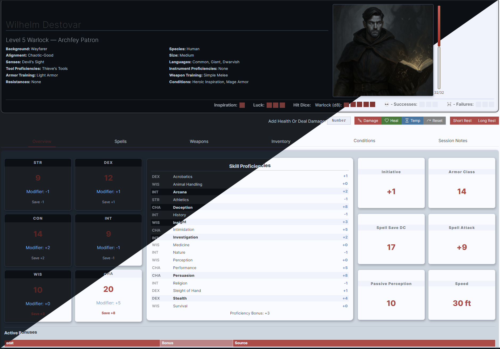
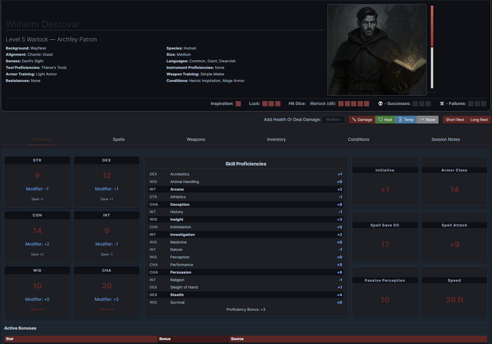

# Obsidian D&D 2024 Character Sheet (Dataview + Meta Bind)

This repository contains a complete Obsidian-based Dungeons & Dragons 2024 Character Sheet system.  
It uses **DataviewJS**, **Meta Bind**, and custom scripts to dynamically render character data stored in **YAML frontmatter**.

Requires content sourced from [TTRPG-Convert-CLI 5e - Obsidian TTRPG Tutorials](https://obsidianttrpgtutorials.com/Obsidian+TTRPG+Tutorials/Plugin+Tutorials/TTRPG-Convert-CLI/TTRPG-Convert-CLI+5e)

This project supports:

- Single-class and multi-class characters  
- Automatic spell preparation tracking  
- Concentration management  
- Hit dice usage  
- Gear & inventory tracking  
- Feats, species traits, languages, tools, senses  
- Dynamic AC and Character Stat calculations  
- Full support for Pact Magic, half-casters, and multi-class progression  
- Custom buttons for casting, preparing, resting, and item management  

---


## 📘 Documentation

### Preparation
Obtain the required source material via the TTRPG-Convert-CLI 5e tool linked above. This content must reside in your Obsidian vault under '3. Mechanics/CLI'. If your path varies from this then there is a frontmatter value labeled 'BASE_FOLDER' that must be updated.

All of your character details need to be entered into the frontmatter. You will not need to modify any of the JavaScript code that makes up this character sheet.

| Frontmatter Value | Type   | Details                                     |
| ----------------- | ------ | ------------------------------------------- |
| `BASE_FOLDER:`    | String | The relative path of your TTRPG-CLI content |
```yaml
BASE_FOLDER: 3. Mechanics/CLI
```


### Quick Start
- Install Obsidian and the required plugins (Dataview, Meta Bind, ITS Theme)
- Download Git repository and open it as a folder in Obsidian (You will be prompted to tell obsidian that you trust the content)
- Copy CLI Content into `3. Mechanics\CLI` (There is a frontmatter variable `BASE_FOLDER` that can be set if your path varies.)

### Features
|  |  |
|---|---|
|  |  |
| *Supports Light or Dark Mode* | *Main Overview Tab, Showcasing Character Stats* |

### Basic Info

| Frontmatter Value       | Type     | Details                                                                |
| ----------------------- | -------- | ---------------------------------------------------------------------- |
| `Level:`                | Number   | Level                                                                  |
| `STR:`                  | Number   | Strength Score                                                         |
| `DEX:`                  | Number   | Dexterity Score                                                        |
| `CON:`                  | Number   | Constitututeion Score                                                  |
| `INT:`                  | Number   | Characters Inteligence Score                                           |
| `WIS:`                  | Number   | Characters Wisdom Score                                                |
| `CHA:`                  | Number   | Charisma Score                                                         |
| `name:`                 | String   | Name                                                                   |
| `background:`           | String   | Background                                                             |
| `species:`              | String   | Species (For Drow, use Elf)                                            |
| `alignment:`            | String   | DnD Character Alignment                                                |
| `size:`                 | String   | Size                                                                   |
| `senses:`               | String   | Darkvision, Devil's Site                                               |
| `species_traits:`       | String[] | Array of traits for a species (If Drow, this is where you list it)     |
| `languages:`            | String[] | Array of various languages known                                       |
| `tools:`                | String[] | Array of tools with which you are proficient                           |
| `instruments:`          | String[] | Array of instruments with which you are proficient                     |
| `image:`                | String[] | Array of images for your character (to display in the header)          |
| `Spellcasting_Ability:` | String   | Stat used to calculate your spellcasting - INT, CHA, WIS               |
| `speed:`                | Number   | Number; the speed of your character                                    |
| `Base_AC:`              | Number   | Number; Normally 10. Your Dex modifier is calculated and added to this |
| `armor_training:`       | String[] | Armor/Shield allowed for your character                                |
| `weapon_training:`      | String[] | Weapon types allowed for your character                                |
| `purse:`                | Number   | The amount of gold held                                                |
```yaml
Level: 7
STR: 9
DEX: 12
CON: 14
INT: 9
WIS: 10
CHA: 20
name: Wilhelm Destovar
background: Wayfarer
species: Elf
alignment: Chaotic-Good
size: Medium
senses: Devil's Site
species_traits:
  - Drow
  - Darkvision
  - Elven Lineage
  - Fey Ancestry
  - Keen Senses
  - Trance
languages:
  - Common
  - Giant
  - Dwarvish
tools:
  - Thieve's Tools
instruments:
  - lute
image:
  - z_Assets/Misc/Wilhelm_Portrait.png
  - z_Assets/Misc/Wilhelm_Eldritch_Blast.png
Spellcasting_Ability: CHA
speed: 30
Base_AC: 10
armor_training:
  - Light Armor
  - Medium Armor
  - Shields
weapon_training:
  - Simple Weapons
  - Martial Weapons
purse: 67
```

### Class Info

| Frontmatter Value | Type                     | Details                                                                                                                  |
| ----------------- | ------------------------ | ------------------------------------------------------------------------------------------------------------------------ |
| `dndClass:`       | String or String[Object] | For Single Class, list one DnD Class. For multi-class, list each DnD class, along with the number of levels in the class |
| `subclass:`       | String or String[]       | For Single Class, list one DnD Class. For multi-class, provide an array of all subclasses                                |
##### Single Class Example (Warlock - Archfey Patron)
```yaml
dndClass: Warlock
subclass: Archfey Patron
```
##### Multi-Class Example (Level 3 Warlock - Archfey Patron/Level 4 Paladin - Oath of Vengeance)
```yaml
dndClass: 
  - Warlock: 3
  - Paladin: 4
subclass: 
  - Archfey Patron
  - Oath of Vengeance
```


### Eldritch Invocations

| Frontmatter Value      | Type     | Details                                                     |
| ---------------------- | -------- | ----------------------------------------------------------- |
| `Eldritch_Invocations` | String[] | Tracks selected Eldritch Invocations for the Warlock class. |
This section must be included if your class is Warlock. Failure to do so will cause the Spells Table to fail loading
```yaml
Eldritch_Invocations:
  - Armor of Shadows
  - Agonizing Blast
  - Devil's Sight
```


### Feats

| Frotmatter Value | Type   | Details |
| ---------------- | ------ | ------- |
| `feats:`         | Object | Feats   |
Most feats are tracked simply as an array of strings. This example tracks the Alert and Savage Attacker feats.
```yaml
feats:
  - Alert
  - Savage Attacker
```

Magic Initiate and Shadow Touched are configured differently, but still under the feats object. This is done so the spell slots associated are tracked separately than other spell slots. This example tracks Lucky, Magic Initiate, and Shadow Touched feats.
```yaml
feats:
  - Lucky
  - Magic Initiate:
      class: Druid
      spell: Healing Word
      cantrips:
        - Guidance
        - Message
  - Shadow Touched:
      spell: Silent Image
```


 
### Health Tracking

| Frontmatter Value | Type   | Details                                                                   |
| ----------------- | ------ | ------------------------------------------------------------------------- |
| `health:`         | Object | Object to hold health data                                                |
| `health.max:`     | Object | Max Hit Points                                                            |
| `health.temp:`    | Object | Max Temp Hit Points                                                       |
| `health.maxTmp:`  | Object | Used to display temp hp bar. This gets reset any time temp HP is assigned |
```yaml
health:
  max: 32
  current: 32
  temp: 0
  maxTmp: 10
```


### Proficiencies

| Frontmatter Value | Type   | Details                                                              |
| ----------------- | ------ | -------------------------------------------------------------------- |
| `Proficiencies:`  | Object | Provide the Save or Skill Proficiency; 1 = Proficient, 2 = Expertise |
```yaml
Proficiencies:
  WIS_SAVE: 1
  CHA_SAVE: 1
  Stealth: 1
  Arcana: 1
  Investigation: 1
  Insight: 1
  Deception: 2
  Persuasion: 1
```

### Inventory

| Frontmatter Value | Type   | Details                                           |
| ----------------- | ------ | ------------------------------------------------- |
| `inventory:`      | Object | This item holds all of your character's inventory |

Text inside parentheses is ignored so you can add additional description there. In this example, 'Book (Occult Lore)' links to a note in the items folder called book-xphb

  - If you use the inventory table UI to add an item to the table that cannot directly be linked to a note, a note in the items folder will be created with -homebrew appended. There you can add additional flavor text to the item.
  - If you use the UI to add an item that already exists in the table, then the count will increase.
  - The table automatically tracks weight.
  - If a note does not define a value, one is inferred based on the item's rarity..

```yaml
inventory:
  Holy Water: 2
  1 Rod of the Pact Keeper: 1
  Potion of Healing: 1
  Quarterstaff: 1
  Bedroll: 1
  Book (Occult Lore): 1
  Sickle: 1
```

### Spell Slots

| Frontmatter Value | Type      | Details                                                                                                                                                                                                                                                                                                              |
| ----------------- | --------- | -------------------------------------------------------------------------------------------------------------------------------------------------------------------------------------------------------------------------------------------------------------------------------------------------------------------- |
| `spell_slot:`     | Object [] | The Spell Slot Tracker will generate the appropriate spell slots based on the current character's Level, Class and Subclass. Initially, the spell slots will be shown as empty. As long as you have one spell slot configured, additional spell slots will populate in frontmatter once they have been toggled 'On'. |
Example: Level 1 and 2 spell slots
```yaml
spell_slot:
  level1_1: true
  level1_2: true
  level2_1: true
  level2_2: true
```
Example: Pact Magic Spell Slots
```yaml
spell_slot:
  pact1: true
  pact2: true
  pact3: true
  pact4: true
  arcanum1: true
  arcanum2: true
  arcanum3: true
  arcanum4: true
```
Example: Druid spell slot from Magic Initiate (Druid)
```yaml
spell_slot:
  druid: true
```

### Spells

| Frontmatter Value                 | Type     | Details                                                                                                                                |
| --------------------------------- | -------- | -------------------------------------------------------------------------------------------------------------------------------------- |
| `Spells:`                         | Object   | Container attribute for different catagories of spells                                                                                 |
| `Spells.Prepared.Cantrips`        | String[] | List the number of cantrips allowed on Classes Prepared Cantrips Table                                                                 |
| `Spells.Prepared.Spells`          | String[] | List the number of spells allowed on Classes Prepared Spells Table                                                                     |
| `Spells.Always_Prepared.Cantrips` | String[] | List cantrips that are granted from subclasses or feats that are always prepared and do not count against your prepared cantrip total. |
| `Spells.Always_Prepared.Spells`   | String[] | List spells that are granted from subclasses or feats that are always prepared and do not count against your prepared spell total.     |
| `Spells.Known.Cantrips`           | String[] | List of known cantrips that are not currently prepared.                                                                                |
| `Spells.Known.Spells`             | String[] | List of known spells that are not currently prepared.                                                                                  |
Example: Default spells with no spells/cantrips selected
```yaml
Spells:
  Prepared:
    Cantrips:
    Spells:
  Always_Prepared:
    Cantrips:
    Spells:
  Known:
    Cantrips: []
    Spells: []
```
Example: 1st level Wizard that can prepare 3 cantrips and 4 spells. They know 6 spells, so the 2 spells in reserve are listed in the known section.
```yaml
Spells:
  Prepared:
    Cantrips:
      - Acid Splash
      - Blade Ward
      - Chill Touch
    Spells:
      - Alarm
      - Burning Hands
      - Charm Person
      - Chromatic Orb
  Always_Prepared:
    Cantrips:
    Spells:
  Known:
    Cantrips: []
    Spells:
      - Color Spray
      - Comprehend Languages
```

Example: This same level 1 Wizard with the Magic Initiate feat, which grants 1 level 1 spell and 2 cantrips that count as always prepared.
```yaml
Spells:
  Prepared:
    Cantrips:
      - Acid Splash
      - Blade Ward
      - Chill Touch
    Spells:
      - Alarm
      - Burning Hands
      - Charm Person
      - Chromatic Orb
  Always_Prepared:
    Cantrips:
      - Guidance
      - Message
    Spells:
      - Healng Word
  Known:
    Cantrips: []
    Spells:
      - Color Spray
      - Comprehend Languages
```

The Spell Table in the UI can be used to manage Prepared/Known spells
▼ Move Spell from Prepared List to Known

▲ Move Spell from Known List to Prepared

✨Cast Spell Button - Triggers Concentration condition for spells that require concentration. When taking damage, if you have concentration active, a message will display reminding you to roll a concentration check.

You can use the table to add spells to the Spell table. Spells are initially added to the Known Spells section, and can be moved up to the Prepared Spells section.


### Stat Bonuses
Some items, feats, class features, or species traits grant bonuses to character attributes, making it difficult to account for everything manually.  
The `Stat_Bonus` frontmatter exists to handle these edge cases cleanly and consistently.


| Frontmatter Value | Type          | Details                                                            |
| ----------------- | ------------- | ------------------------------------------------------------------ |
| `Stat_Bonus`      | Nested Object | Assign bonuses to nearly any stat, including complex dynamic ones. |


#### **Notes on Usage**

- You may assign bonuses to **any stat** referenced in the character sheet:    
    - Ability scores (STR, DEX, etc.)        
    - Initiative        
    - Armor_Class        
    - Spell_Attack        
    - Spell_Save_DC        
    - Perception        
    - Speed        
    - and any other skill or derived stat        
- Every bonus may optionally have a `source:` description that displays in the Active Bonuses table.    
- Multiple bonuses to different stats are allowed within the same block.

#### Supported Bonus Types
a simple numerical bonus: 
```yaml
Armor_Class: 1
```

#### **Ability Scores**
You may reference the full ability score:
```yaml
STR_MOD, DEX_MOD, CON_MOD, INT_MOD, WIS_MOD, CHA_MOD
```

#### Proficiency Bonus
```yaml
PROF
```

#### Math Expressions
```yaml
+  -  *  /  ( )
```
Examples:
- `DEX_MOD + PROF`    
- `(WIS_MOD * 2) - 1`    
- `(STR_MOD + DEX_MOD) / 2`

Example: +1 Rod of the Pact Keeper (+1 to Spell Attack and Spell Save DC)
```yaml
Stat_Bonus:
  Spell_Attack:
    value: 1
    source: 1 Rod of the Pact Keeper
  Spell_Save_DC:
    value: 1
    source: 1 Rod of the Pact Keeper
```
Example: Studded Leather Armor (adds a +2 to the Base AC + Dex Modifier calculation)
```yaml
Stat_Bonus:
  Armor_Class:
    value: 2
    source: Studded Leather Armor
```
Example: Dread Ambusher, adding their Wisdom Modifier to Initiative
```yaml
Stat_Bonus:
  Initiative:
    value: WIS_MOD
    source: Dread Ambusher
```
Example: Alert Feat, adding Proficiency Bonus to Initiative
```yaml
Stat_Bonus:
  Initiative:
    value: PROF
    source: Alert Feat
```

### Weapon Mastery
The weapon mastery table will allow you to select the weapon types that you want to claim mastery over. You can do this after a long rest. The table will give you the amount of weapon mastery slots assigned by your class.

| Frontmatter Value | Type   | Details                                      |
| ----------------- | ------ | -------------------------------------------- |
| `mastery:`        | Object | List your weapons and their weapon masteries |
Example: This example is for a Soulknife Rogue who has a dagger, shortbow, shortsward, and Psychic Blades
```yaml
mastery:
  Dagger: Nick
  Psychic Blade: Vex
  Shortbow: Vex
  Shortsword: Nick
```
